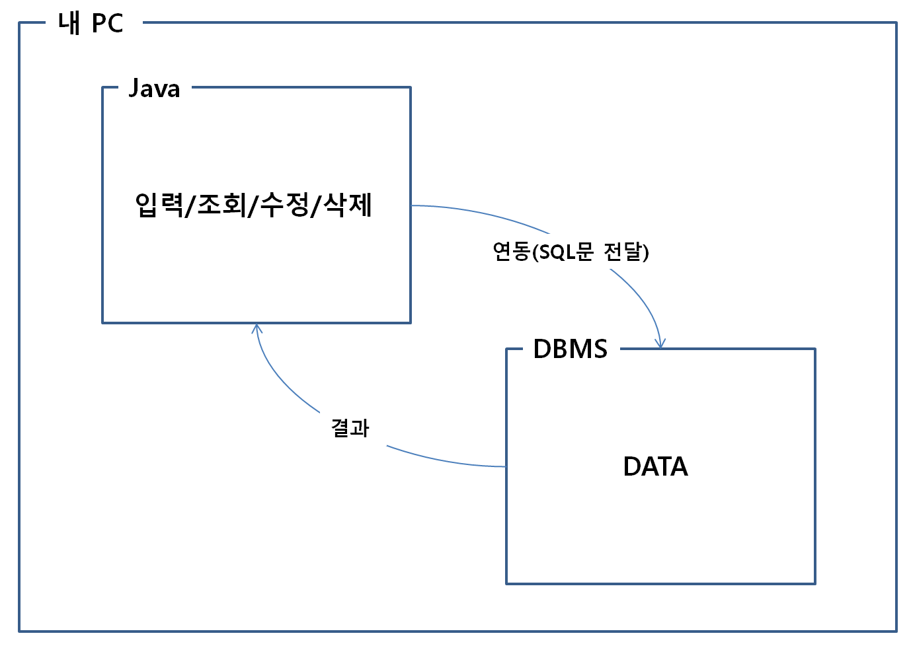

# JDBC란

#### -> 자바 프로그램이 데이터베이스와 연결되어 데이터를 주고 받을 수 있게 해주는 프로그래밍 인터페이스

 

* 위 그림에서 현재 내 PC에는 Java프로그램과 DBMS프로그램이 설치되어 있다.

* DBMS의 종류에는 Oracle, MySQL, MariaDB, MSSQL 등이 있다.

* DBMS의 종류마다 SQL을 다루는 방식이 조금씩 차이가 있다.

* JDBC는 인터페이스로 존재하며, 인터페이스 안에 메서드가 선언되어 있다.

* 각각의 DBMS는 JDBC 인터페이스를 상속 받아 소스코드를 만들었다.

* 즉, 각각의 DBMS의 JDBC는 메서드의 이름은 같지만, DBMS 종류에 따라 메소드의 내용은 다르다.

* 각각의 DBMS 회사별로 메소드 내용이 채워져 있는 .jar 파일이 java api에 존재하고, 사용자가 사용하는 DBMS에 맞추어 사용하면 된다.

