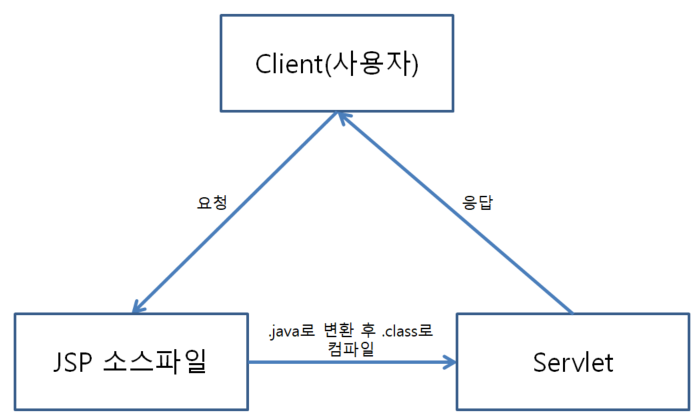

JSP
================================================================

## 1. JSP란

 *  ### JSP(Java Server Page)
    * #### HTML 코드에 JAVA코드를 넣어 동적 웹페이지를 생성하는 웹 어플리케이션 도구
    

    * #### 클라이언트가 웹 브라우저를 통해 jsp로 요청을 보내면 JSP 소스파일은 .java 파일로 변환 후에 .class로 컴파일 후 클라이언트에게 웹 브라우즈를 통해 응답하게 된다.

        #### * Servlet은 Servlet 공부 페이지에서 더 자세하게 정리할 예정(+ JSP와 Servlet의 차이도 거기서 다룰 예정)
    
    * #### JSP에서 변수의 유효성 범위
        -> JSP 페이지, 즉 .jsp로 작성된 하나의 파일은 Java에서 하나의 Main 클래스에 대응된다고 볼 수 있다.

        -> 따라서 Java와 같이 jsp페이지 간에 변수 공유가 되지 않는다.
        
        #### * 이 때문에 여러가지 다른 방법들을 통해 변수를 전달한다. 전달 방법은 추후에 더 자세하게 다룰 예정이다.
    
    

    

    * #### JSP의 기본 태그

        

        1. <%@ ''' %>의 형식.
            
            -> 지시자(Directive) JSP 페이지의 속성을 지정함
            
            -> 주로 JSP페이지의 상단에 명시된다.
            
            -> JSP페이지의 각종 기본 설정을 명시하거나 Java의 import 구문을 명시하는데 사용한다.
        

        2. <% %>의 형식.

            -> 스크립트릿(Scriptlet) Java 소스코드가 작성되는 영역.

            -> 이 영역은 일반 Java 소스의 main() 메서드와 같은 역할을 한다.

            -> 두 개 이상의 스크립트릿 블록은 페이지 실행시에 하나로 병합되어 실행된다.

            * System.out.println()은 콘솔 영역에 내용을 출력하기 때문에 이 기능의 결과는 사용자에게(웹 브라우저)표시되지 않는다.(개발자가 프로그래밍을 하면서 디버깅 용도로 사용한다.)
        

        3. <%= %>의 형식.

            -> <% out.println(message); %>는 웹 브라우저에 출력하는 기능을 한다.

            -> 출력문의 약식 표현으로 <%=message %>를 사용하며 표현식(Expression)이라고도 한다.

        

        4. <%- -%>의 형식.

            -> 주석(Comment)를 처리하는 형식으로 일반적으로 JSP 페이지 설명 혹은 코드 설명을 적을 때 사용한다. Java의 주석과 마찮가지로 코드에는 영향을 주지 않는다.

