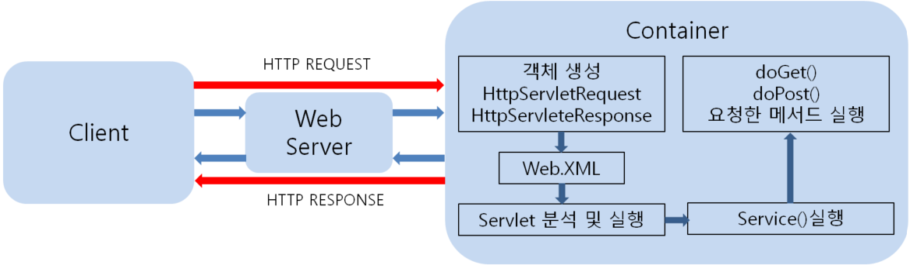
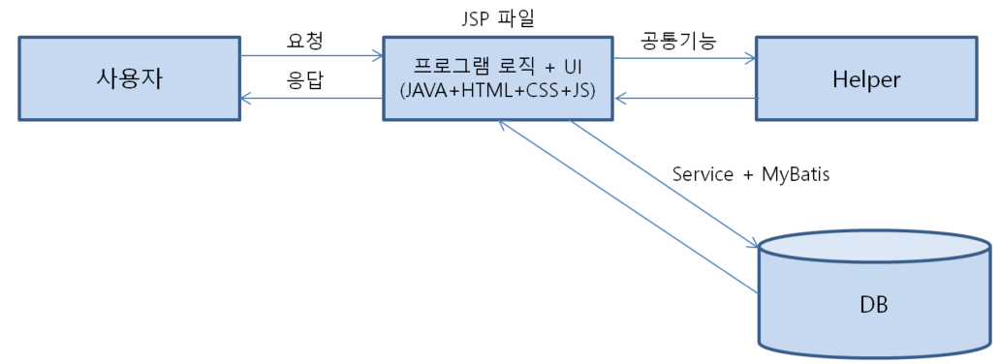
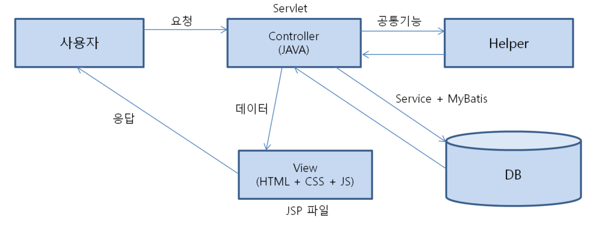

# Servlet

## Servlet이란

#### -> 웹 프로그래밍에서 클라이언트(사용자)의 요청을 처리하고, 그 결과를 다시 클라이언트에게 전송하는 HttpServlet 클래스의 구현 규칙을 지킨 자바 프로그래밍 기술이다.
 

 

### 실행 과정
1. 클라이언트가 웹서버에게 요청을 한다.
2. 웹 서버는 그 요청을 톰캣(Tomcat)과 같은 WAS(Web Application Server) 웹 컨테이너에 위임한다.
3. 톰캣은 HttpServletRequest, HttpServletResponse 객체를 생성한다.
4. Web.xml이 어느 서블릿에 대해 요청한 것인지를 탐색한다.
5. 해당하는 서블릿에서 service() 메소드를 호출한다.
6. 동적 페이지를 생성 후 요청 방식에 따라 요청한 메소드를 실행한다.

 
 

## JSP vs Servlet 비교

* ### JSP
    * 장점: HTML 태그의 처리가 서블릿보다 간결하다.
    * 단점: Java코드와 HTML 코드가 서로 섞여 유지 보수가 불편하다(일명 스파게티 코드)

* ### Servlet
    * 장점: 순수 Java 코드로만 작성되기 때문에 코드의 유지보수에 유리하다.
    * HTML 태그를 문자열로 묶어서 출력해야 하기 때문에 많은 노력을 필요로 한다.

 

## Controller

#### -> 프로그램의 비지니스 로직은 서블릿에서 담당하고, 웹 페이지에 HTML을 출력하기 위한 기능은 JSP에서 담당하여 프로그램의 로직과 화면의 뷰를 분리하여 처리하도록 하는 방식

> * #### Model1 : 순수 JSP 파일만으로 작성되는 방식
> * #### Model2 : Servlet과 JSP로 나누어 구현되는 방식

 

### 기존 웹 페이지 개발 방식

* 공통 기능들을 Helper 클래스와 Service + Mybatis 패턴을 적용하여 재 사용 가능한 형태의 모듈화

* 여전히 JSP 하나의 파일에서 Java 프로그램과 화면을 출력하는 HTML + CSS + JS가 존재한다.(스파게티 코드)

* 스파게티 코드의 경우 유지보수가 매우 어렵다.

# MVC 패턴이란

### -> 요청을 받는 부분과 응답을 처리하는 부분을 분리한 방법.

* #### Model2(MVC 패턴)

 

* ### 컨트롤러
    -> 사용자가 요청한 것을 JAVA 프로그램이 일련의 처리과정을 거쳐서 생성한 데이터를 View로 전달한다.
    
    -> View에서는 전달받은 데이터를 웹 페이지에 보여줌으로써 사용자에게 응답한다.

#### ** 즉, MVC 패턴은 화면과 데이터 처리 과정을 분리해놓은 개발 패턴이다.
#### ** 이러한 방법의 경우 프로그램 로직과 화면이 분리되었기 때문에 코드 유지보수가 쉬워진다.
