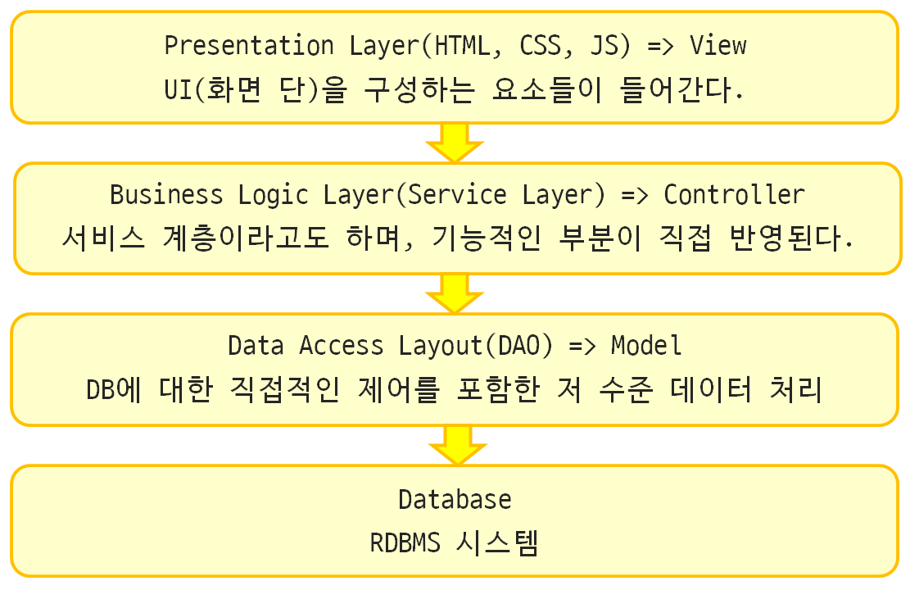

# Framework란

### -> 뼈대를 이루는 코드들의 묶음
    * 프로그램의 기본 흐름이나 구조를 정하고, 정한 구조를 기준으로 자신의 코드를 추가하는 방식으로 개발 하도록 하는 프로그래밍의 기본 틀을 의미.

    * 개발에 필요한 기본 구조는 제공, 기본 구조에 필요한 부분을 조립하는 형태로 개발이 진행된다.

    * 장점 : 
        1. 개발 기간을 단축시킬 수 있다.
        2. 팀 내의 개인의 개발 능력에 관계 없이 프로그램의 품질을 일정하게 보장할 수 있다.

### 일반적인 Framework의 구조

# Spring이란
* #### 자바 기반의 웹 어플리케이션을 만들 수 있는 프레임워크
* #### 동적 웹 사이트 개발을 위한 여러가지 기능을 제공
* #### 대한민국 공공기관 웹 서비스 개발시 사용을 권장하는 전자 정부 표준 프레임워크의 기반 기술로 사용됨

 

### Spring 특징
1. Spring은 경량 컨테이너로 자바 객체를 직접 Spring안에서 관리합니다. 객체의 생명주기(생성 및 소멸)를 관리하며, Spring 컨테이너에서 필요한 객체를 가져와 사용합니다.
    
    ->경량 컨테이너란, 간단한 jar 파일들의 조합만으로 모든 개발이 가능하도록 구성된 프레임 워크

    -> POJO(Plain Old Java Object) 프로그램의 구현을 위해 특정 인터페이스를 구현, 상속받을 필요 없이, 일반적인 Java코드와 기존에 존재하는 라이브러리들을 그대로 활용하는 방식

    -> POJO VS Java Beans
     
    ### POJO

    1. POJO는 자바 객체의 표준이며 Java에 의한 엄격한 경계가 존재하지 않는다.
    2. POJO는 가독성과 재사용을 중요하게 여긴다.
    3. POJO는 Java에 의한 제약 조건이 적기 때문에 읽고 쓰기가 쉽다.

    ### Java Beans

    1. Java Beans는 엄격한 규칙을 갖고 있다.
    2. Java Beans는 POJO이지만, POJO는 Java Beans가 아니다.

2. Spring은 자바 객체와 라이브러리들을 관리해주며, 톰캣과 같은 WAS가 내장되어 있어 자바 웹 어플리케이션을 구동할 수 있다.

3. 확장성이 높다.

    ->다른 프레임워크들과의 통합을 지원하기 때문에 많은 라이브러리가 Spring에서 지원되고 있따.

4. 제어의 반전(역전)(IOC, Inversion Of Control)

    * 일반적으로 자바 프로그램에서는 각 객체들이 프로그램의 흐름을 결정하고 객체를 직접 생성하여 메소드를 호출하는 방식으로 사용하였다. 쉽게 풀어 설명하자면, A 객체에서 B객체에 있는 메소드를 사용하고 싶다면, B객체를 A객체에서 선언하고 메모리를 할당한 뒤에 메소드를 호출 할 수 있다.
    
    * 하지만 IOC는 개발자가 프레임워크의 기능을 호출하는 형태가 아니라, 프레임 워크가 개발자의 코드를 호출하는 방식으로 개발자는 전체를 직접 구현하지 않고, 자신이 개발한 코드를 부분적으로 "끼워넣기"하는 형태로 구현 할 수 있다.

    * 요약하자면, Spring의 IOC는 '클래스 내의 객체생성 -> 생성된 객체의 메소드 호출' 이 아니라, '스프링에게 제어를 위임하여 스프링이 만든 객체를 주입 -> 스프링이 만든 객체의 메소드 호출'구조 입니다.

5. 의존성 주입 DI 

    
    

